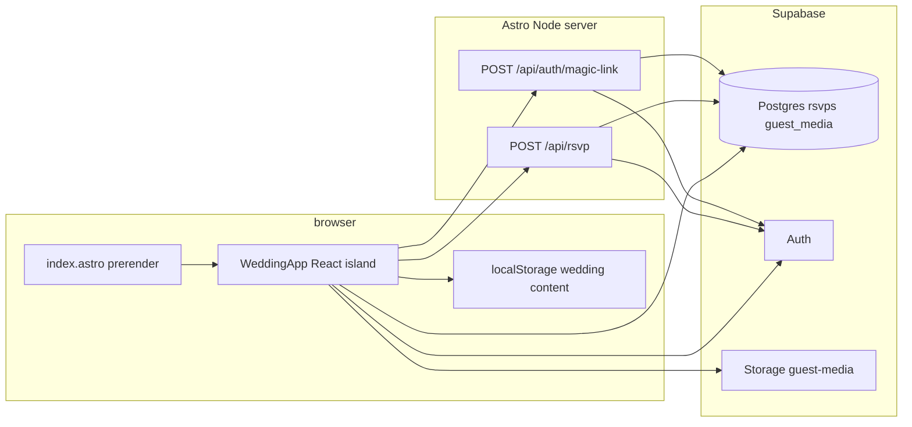

# Architecture

## High-level

## Entry points

| Path | Role |
|------|------|
| `src/pages/index.astro` | `prerender = true`; loads CSS; mounts `WeddingApp` with `client:only="react"`. |
| `src/layouts/Layout.astro` | HTML shell, fonts, skip link, `<main id="main">`, referrer meta. |
| `src/pages/api/rsvp.ts` | `prerender = false`. Validates RSVP JSON, rate limit, upserts `rsvps`, provisions Auth user. |
| `src/pages/api/auth/magic-link.ts` | Confirms email on guest list, sends Supabase OTP (`shouldCreateUser: false`). |

## React application

- **`WeddingApp.tsx`** — `WeddingContentProvider`, section visibility, `GuestPortal`, optional `ClientAdmin` + `TweaksPanel` (dev or `PUBLIC_SHOW_SITE_EDITOR=true`).
- **`src/lib/weddingContent.tsx`** — Default content object, `deepMerge`, `localStorage` persistence, context API.
- **`src/components/wedding/*`** — Section UI: `Core` (nav, hero, details, story), `RsvpBlock`, `ExtrasBlock`.

## Internationalization

- **`src/i18n/en.ts`** — API-facing error codes and messages for consistent JSON errors.
- Marketing copy lives in **`weddingContent`** defaults and the admin JSON shape (English). Adding another locale would mean extracting those strings and wiring a picker.

## Observability

- **`src/lib/server-log.ts`** — JSON lines to stdout from API routes on misconfiguration or persistence failures.
- For hosted environments, forward stdout to your log stack; optional Sentry (or similar) can wrap API handlers later without changing client bundles.

## Performance notes

- The **guest media** grid calls `createSignedUrl` once per row; fine for small albums, consider batching or shorter TTL tuning if the album grows large.

## Tests

- **Vitest** + **jsdom** (`vitest.config.ts`).
- Tests live next to code: `src/**/*.test.ts` (e.g. `rate-limit`, `sanitize-poster`, `api/json` parsers).

## Build output

- **`@astrojs/node`** `standalone`: server entry under `dist/` plus prerendered `index.html`.
- API routes execute only on the Node server with runtime environment variables.
